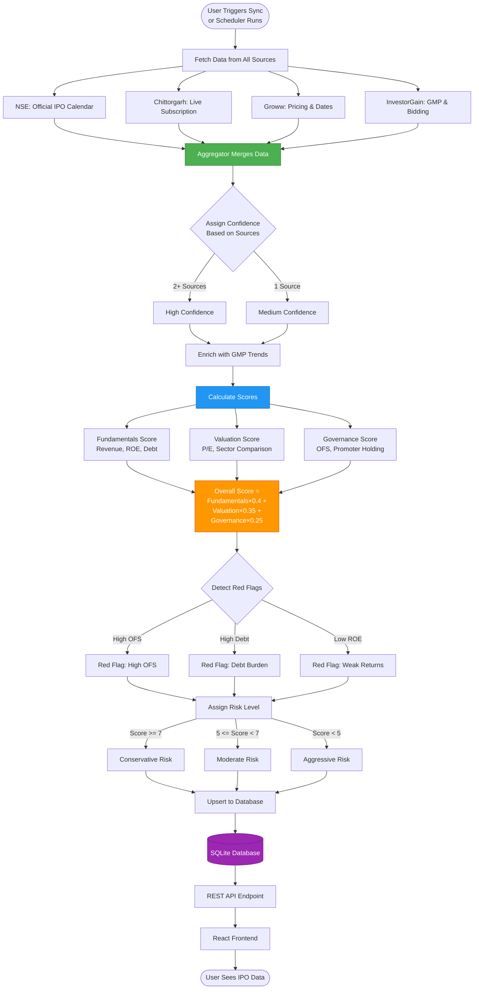
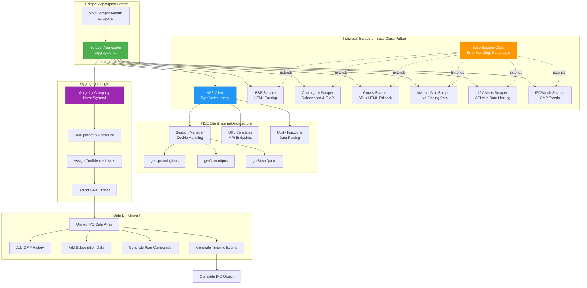
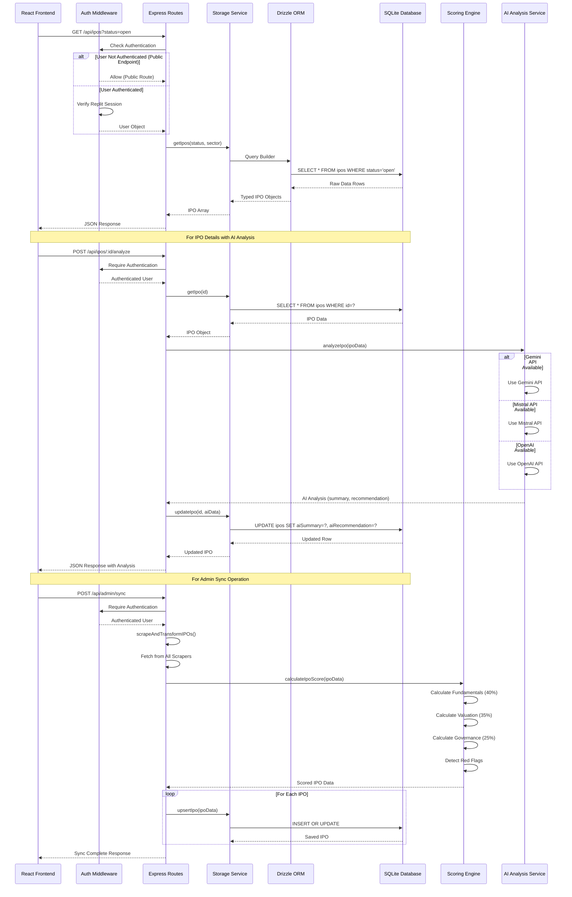
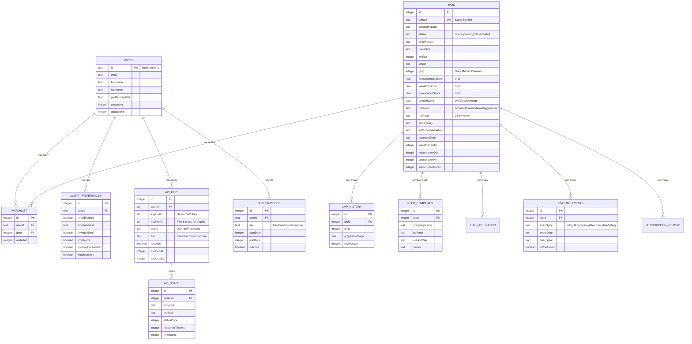
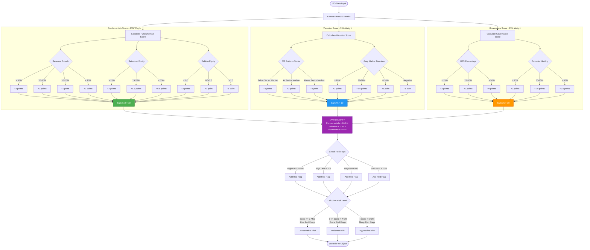
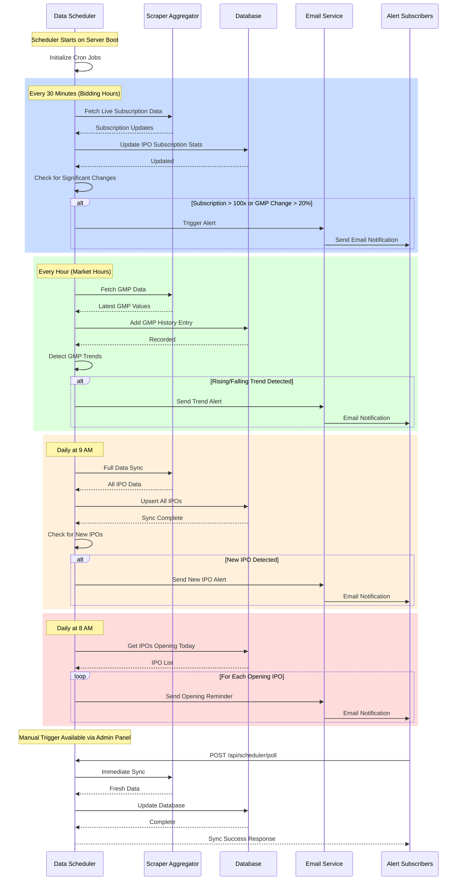

# IPO Tracker - Backend Architecture Diagrams

> **Interview Guide**: Use these diagrams to explain your backend architecture clearly and confidently. Start with Diagram 1 (System Overview) and drill down into specific areas based on interviewer questions.

---

## Diagram 1: High-Level System Architecture

**Use this to**: Start your explanation - shows the complete system at a glance

```mermaid
graph TB
    subgraph "External Data Sources"
        NSE[NSE API<br/>Official Exchange Data]
        BSE[BSE API<br/>Official Exchange Data]
        Chittorgarh[Chittorgarh<br/>Live Subscription & GMP]
        Groww[Groww API<br/>Calendar & Pricing]
        InvestorGain[InvestorGain<br/>Real-time Bidding]
        IPOAlerts[IPOAlerts API<br/>Comprehensive Data]
        IPOWatch[IPOWatch<br/>GMP Trends]
    end

    subgraph "Backend Services - Node.js/Express"
        subgraph "Scraping Layer"
            Aggregator[Scraper Aggregator<br/>Multi-source Merger]
            NSEScraper[NSE Client]
            BSEScraper[BSE Scraper]
            ChitScraper[Chittorgarh Scraper]
            GrowwScraper[Groww Scraper]
            IGScraper[InvestorGain Scraper]
            IPOAScraper[IPOAlerts Scraper]
            IPOWScraper[IPOWatch Scraper]
        end
        
        subgraph "Business Logic"
            Scoring[Scoring Engine<br/>Fundamentals/Valuation/Governance]
            AIAnalysis[AI Analysis Service<br/>Gemini/Mistral/OpenAI]
            Scheduler[Data Scheduler<br/>Automated Polling]
            EmailService[Email Service<br/>Resend Integration]
        end
        
        subgraph "API Layer"
            Routes[Express Routes<br/>REST API]
            Auth[Replit Auth<br/>Authentication]
            APIKeys[API Key Service<br/>Rate Limiting]
        end
        
        subgraph "Data Layer"
            Storage[Storage Service<br/>Drizzle ORM]
            DB[(SQLite Database<br/>local.db)]
        end
    end

    subgraph "Frontend - React/TypeScript"
        Dashboard[Dashboard<br/>IPO Listings]
        Details[IPO Details<br/>Analysis & Scores]
        Watchlist[Watchlist<br/>User Tracking]
        Admin[Admin Panel<br/>Data Sync]
    end

    NSE --> NSEScraper
    BSE --> BSEScraper
    Chittorgarh --> ChitScraper
    Groww --> GrowwScraper
    InvestorGain --> IGScraper
    IPOAlerts --> IPOAScraper
    IPOWatch --> IPOWScraper
    
    NSEScraper --> Aggregator
    BSEScraper --> Aggregator
    ChitScraper --> Aggregator
    GrowwScraper --> Aggregator
    IGScraper --> Aggregator
    IPOAScraper --> Aggregator
    IPOWScraper --> Aggregator
    
    Aggregator --> Scoring
    Scoring --> Storage
    Storage --> DB
    
    Routes --> Storage
    Routes --> Scoring
    Routes --> AIAnalysis
    Routes --> Scheduler
    Routes --> EmailService
    
    Auth --> Routes
    APIKeys --> Routes
    
    Dashboard --> Routes
    Details --> Routes
    Watchlist --> Routes
    Admin --> Routes
    
    Scheduler -.Triggers.-> Aggregator
    EmailService -.Sends Alerts.-> Dashboard

    style Aggregator fill:#4CAF50,stroke:#2E7D32,color:#fff
    style Scoring fill:#2196F3,stroke:#1565C0,color:#fff
    style Routes fill:#FF9800,stroke:#E65100,color:#fff
    style DB fill:#9C27B0,stroke:#6A1B9A,color:#fff
```

**Key Points to Mention**:
- Multi-source data aggregation from 7+ sources
- Modular scraping architecture with individual scrapers
- Scoring engine calculates risk assessment
- RESTful API with authentication and rate limiting
- SQLite for simple, file-based storage

---

## Diagram 2: Data Flow - From Scraping to Display

**Use this to**: Explain how data moves through the system

**Key Points to Mention**:
- Data aggregation from multiple sources for reliability
- Confidence scoring based on source count
- Three-dimensional scoring system (Fundamentals, Valuation, Governance)
- Automated red flag detection
- Risk classification based on scores

---

## Diagram 3: Scraping Architecture Deep Dive

**Use this to**: Explain the scraping system in detail

**Key Points to Mention**:
- Base scraper class provides common functionality (error handling, retries)
- Each scraper is independent and can fail without affecting others
- NSE Client is a custom TypeScript library for official NSE APIs
- Aggregator merges data intelligently using company name/symbol matching
- Confidence levels help prioritize data quality
- Enrichment adds analytical data (peers, timeline, history)

---

## Diagram 4: API Request Lifecycle

**Use this to**: Explain how API requests are processed

**Key Points to Mention**:
- Middleware-based authentication using Replit Auth
- Storage service abstracts database operations
- Drizzle ORM provides type-safe database queries
- AI analysis supports multiple providers with fallback
- Upsert pattern prevents duplicate entries
- Synchronous scoring during data sync

---

## Diagram 5: Database Schema & Relationships

**Use this to**: Explain data modeling and relationships

**Key Points to Mention**:
- SQLite for simplicity (file-based, no external DB needed)
- User-centric design with watchlist and preferences
- IPO as central entity with rich relationships
- Historical tracking (GMP history, subscription history)
- API key management with usage tracking
- Timeline events for IPO lifecycle tracking

---

## Diagram 6: Scoring Engine Algorithm

**Use this to**: Explain the scoring logic in detail

**Key Points to Mention**:
- Three-dimensional scoring: Fundamentals (40%), Valuation (35%), Governance (25%)
- Each dimension scored 0-10 based on specific metrics
- Weighted average produces overall score
- Red flags are detected independently
- Risk level considers both score and red flags
- Transparent, rule-based algorithm (not black box)

---

## Diagram 7: Scheduler & Background Jobs

**Use this to**: Explain automated data updates

**Key Points to Mention**:
- Cron-based scheduling for automated updates
- Different frequencies for different data types
- Market hours awareness (only fetch during trading hours)
- Alert system for significant changes
- Manual trigger option for admins
- Email notifications via Resend API

---

## Interview Talking Points

### Opening Statement
> "I built an IPO Tracker application that aggregates data from 7+ sources including NSE, BSE, and market data providers. The backend is built with Node.js, Express, and TypeScript, using a modular scraping architecture to ensure data reliability even if individual sources fail."

### Key Technical Highlights

1. **Multi-Source Data Aggregation**
   - "I implemented a scraper aggregator pattern where each data source has its own scraper module extending a base class"
   - "The aggregator merges data intelligently, assigns confidence levels based on source count, and handles conflicts"

2. **Scoring Engine**
   - "I designed a proprietary scoring algorithm that evaluates IPOs across three dimensions: Fundamentals (40%), Valuation (35%), and Governance (25%)"
   - "The system automatically detects red flags like high debt, low promoter holding, or negative market sentiment"

3. **API Architecture**
   - "I built a RESTful API with authentication, rate limiting, and tiered access control"
   - "The API supports both internal frontend consumption and external developer access with API keys"

4. **Database Design**
   - "I chose SQLite for simplicity and portability, using Drizzle ORM for type-safe queries"
   - "The schema supports rich relationships including watchlists, GMP history, peer comparisons, and timeline tracking"

5. **Background Jobs**
   - "I implemented a scheduler that polls data sources at different intervals based on market hours"
   - "The system sends email alerts for new IPOs, significant GMP changes, and opening date reminders"

6. **Error Handling & Reliability**
   - "Each scraper has retry logic and error handling, so if one source fails, others continue working"
   - "The aggregator assigns confidence levels to help users understand data quality"

### Questions You Might Get

**Q: Why did you choose SQLite over PostgreSQL/MySQL?**
> "For this project, SQLite was ideal because it's file-based, requires no external setup, and handles the read-heavy workload well. The data volume is manageable (hundreds of IPOs, not millions), and SQLite's simplicity made deployment easier. If we needed horizontal scaling or concurrent writes, I'd migrate to PostgreSQL."

**Q: How do you handle rate limiting from data sources?**
> "I implemented exponential backoff and retry logic in the base scraper class. For API sources like IPOAlerts, I track daily usage limits and implement request throttling. The scheduler also respects market hours to avoid unnecessary requests."

**Q: How do you ensure data accuracy when sources conflict?**
> "The aggregator prioritizes data based on source reliability and completeness. NSE and BSE (official exchanges) are trusted most. When values conflict, I use the most recent data from the highest-confidence source. I also expose confidence levels to users."

**Q: What would you do differently if you rebuilt this?**
> "I'd consider using a message queue (like Bull/Redis) for background jobs instead of in-memory scheduling. I'd also implement caching (Redis) for frequently accessed data. For scaling, I'd separate the scraping service into its own microservice."

---

## How to Use These Diagrams in Interviews

1. **Start with Diagram 1** - Give the big picture
2. **Use Diagram 2** - Explain data flow when asked "how does it work?"
3. **Use Diagram 3** - Deep dive into scraping when asked about data collection
4. **Use Diagram 4** - Explain request handling when asked about API design
5. **Use Diagram 5** - Show database design when asked about data modeling
6. **Use Diagram 6** - Explain scoring logic when asked about business logic
7. **Use Diagram 7** - Discuss background jobs when asked about automation

**Pro Tip**: Practice drawing simplified versions of these on a whiteboard. Interviewers often ask you to diagram your architecture live!
