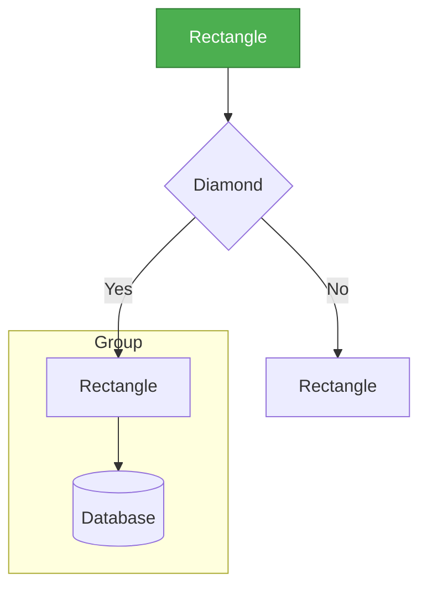
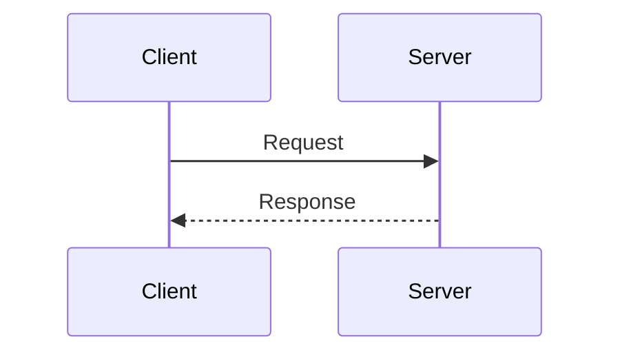
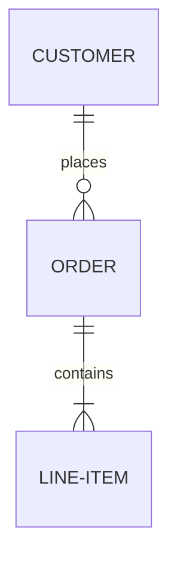

# AI Prompt for Generating Backend Architecture Diagrams

## How to Use This Prompt

Copy the prompt below and paste it into ChatGPT, Claude, or any AI tool that supports Mermaid diagrams. You can customize it by:
- Changing which diagram you want (1-7)
- Asking for specific aspects to be highlighted
- Requesting modifications for different audiences (technical vs non-technical)

---

## Master Prompt

```
I need you to create detailed Mermaid diagrams for my IPO Tracker backend project to use in technical interviews. Here's the project overview:

PROJECT CONTEXT:
- Full-stack IPO tracking application for Indian stock market
- Backend: Node.js, Express, TypeScript, SQLite, Drizzle ORM
- Multi-source data aggregation from 7+ sources (NSE, BSE, Chittorgarh, Groww, InvestorGain, IPOAlerts, IPOWatch)
- Modular scraping architecture with base class pattern
- Proprietary scoring engine (Fundamentals 40%, Valuation 35%, Governance 25%)
- RESTful API with authentication (Replit Auth) and API key management
- Background scheduler for automated data updates
- Email alerts via Resend API
- AI analysis integration (Gemini/Mistral/OpenAI)

KEY BACKEND COMPONENTS:
1. Scraping Layer:
   - Individual scrapers for each data source (extending base scraper class)
   - Scraper aggregator that merges data and assigns confidence levels
   - NSE Client (custom TypeScript library for official NSE APIs)

2. Business Logic:
   - Scoring engine (calculates fundamentals, valuation, governance scores)
   - Red flag detection (high OFS, high debt, negative GMP, etc.)
   - AI analysis service (multi-provider support)
   - Data scheduler (cron-based background jobs)
   - Email service (Resend integration)

3. API Layer:
   - Express routes (REST API)
   - Authentication middleware (Replit Auth)
   - API key service (rate limiting, usage tracking)
   - Public API v1 for external developers

4. Data Layer:
   - Storage service (abstraction over Drizzle ORM)
   - SQLite database (file-based, ./data/local.db)
   - Schema: users, ipos, watchlist, alert_preferences, gmp_history, peer_companies, timeline_events, api_keys, subscriptions, api_usage

DATA FLOW:
1. Scheduler triggers or admin manually syncs
2. All scrapers fetch data from their sources
3. Aggregator merges data, assigns confidence (high: 2+ sources, medium: 1 source)
4. Scoring engine calculates scores and detects red flags
5. Data upserted to SQLite database
6. REST API serves data to React frontend
7. Background jobs send email alerts for changes

SCORING ALGORITHM:
- Fundamentals (40%): Revenue growth, ROE, ROCE, EBITDA margin, Debt-to-Equity
- Valuation (35%): P/E ratio vs sector, GMP, issue size
- Governance (25%): OFS ratio, promoter holding, fresh issue vs OFS
- Overall Score = weighted average (0-10 scale)
- Risk Level: Conservative (≥7), Moderate (5-7), Aggressive (<5)
- Red Flags: High OFS >50%, High Debt >1.5, Negative GMP, Low ROE <10%

Please create the following Mermaid diagram(s):

[CHOOSE ONE OR MORE:]
1. High-Level System Architecture - Shows all components and their relationships
2. Data Flow Diagram - From scraping to display, including scoring
3. Scraping Architecture Deep Dive - Scraper pattern, aggregation logic
4. API Request Lifecycle - Sequence diagram showing request processing
5. Database Schema & Relationships - ER diagram with all tables
6. Scoring Engine Algorithm - Flowchart showing calculation logic
7. Scheduler & Background Jobs - Sequence diagram for automated tasks

REQUIREMENTS:
- Use proper Mermaid syntax (graph TB, flowchart TD, sequenceDiagram, erDiagram)
- Include subgraphs for logical grouping
- Use colors/styling to highlight important components
- Add notes/annotations for clarity
- Make it interview-friendly (clear, professional, easy to explain)
- Include arrows showing data flow direction
- Label relationships clearly

STYLE PREFERENCES:
- Use different colors for different layers (scraping, business logic, API, data)
- Make the diagram visually appealing but not cluttered
- Ensure text is readable (avoid tiny fonts)
- Use standard shapes (rectangles for services, cylinders for databases, etc.)

OUTPUT FORMAT:
- Provide the complete Mermaid code in a code block
- Include a brief explanation of what the diagram shows
- Suggest 2-3 key talking points for interviews
```

---

## Quick Customization Examples

### For a Specific Diagram
```
[Use the master prompt above, but in the "CHOOSE ONE OR MORE" section, specify:]

I want Diagram #3: Scraping Architecture Deep Dive

Please focus on:
- The base scraper class pattern and inheritance
- How the aggregator merges data from multiple sources
- Confidence level assignment logic
- Error handling and retry mechanisms
```

### For a Simplified Version
```
[Add this to the end of the master prompt:]

Please create a SIMPLIFIED version suitable for explaining to non-technical stakeholders. 
Focus on the high-level flow and avoid implementation details.
```

### For a Specific Interview Question
```
[Add this to the end of the master prompt:]

The interviewer asked: "How do you handle data inconsistencies from multiple sources?"

Please create a diagram that specifically illustrates:
- How data from different sources is merged
- Conflict resolution strategy
- Confidence level assignment
- Data validation steps
```

---

## Example Usage in Different Tools

### ChatGPT
1. Copy the master prompt
2. Paste into ChatGPT
3. Specify which diagram(s) you want
4. ChatGPT will generate the Mermaid code
5. Copy the code and paste into a Mermaid viewer (mermaid.live, GitHub, Notion, etc.)

### Claude
1. Same as ChatGPT
2. Claude often provides better diagram structure
3. Can ask for iterations/improvements

### Mermaid Live Editor (mermaid.live)
1. Get the Mermaid code from AI
2. Paste into the editor
3. See live preview
4. Export as PNG/SVG for presentations

### GitHub/GitLab
1. Create a markdown file
2. Add Mermaid code in fenced code blocks with ```mermaid
3. GitHub/GitLab will render it automatically

### Notion
1. Type `/code`
2. Select Mermaid as language
3. Paste the Mermaid code
4. Notion renders it inline

---

## Pro Tips for Interview Usage

1. **Practice Explaining**: Don't just show the diagram - practice narrating it
2. **Start Simple**: Begin with high-level overview, drill down if asked
3. **Be Ready to Draw**: Interviewers might ask you to whiteboard it
4. **Know the Numbers**: Memorize key metrics (7 sources, 3 scoring dimensions, etc.)
5. **Prepare for Follow-ups**: Each diagram should lead to deeper technical discussions

---

## Common Interview Questions These Diagrams Answer

| Question | Use This Diagram |
|----------|------------------|
| "Walk me through your backend architecture" | Diagram 1: System Architecture |
| "How does data flow through your system?" | Diagram 2: Data Flow |
| "How do you collect data from multiple sources?" | Diagram 3: Scraping Architecture |
| "Explain your API design" | Diagram 4: API Request Lifecycle |
| "How is your database structured?" | Diagram 5: Database Schema |
| "How does your scoring algorithm work?" | Diagram 6: Scoring Engine |
| "How do you handle background tasks?" | Diagram 7: Scheduler & Background Jobs |
| "What happens when a user requests IPO data?" | Diagram 4: API Request Lifecycle |
| "How do you ensure data quality?" | Diagram 3: Scraping Architecture |
| "What's your data model?" | Diagram 5: Database Schema |

---

## Modification Prompts

### To Add More Detail
```
Can you expand the [specific section] to show more implementation details?
For example, show the exact API endpoints, database queries, or function names.
```

### To Simplify
```
Can you create a simplified version of this diagram that focuses only on [specific aspect]?
Remove technical details and focus on the conceptual flow.
```

### To Change Style
```
Can you recreate this diagram using [flowchart/sequence/graph] format instead?
Use [specific colors/styling] to match my presentation theme.
```

### To Focus on Specific Technology
```
Can you create a diagram that specifically highlights how [TypeScript/Drizzle ORM/Express/SQLite] 
is used in the architecture?
```

---

## Ready-to-Use Variations

### Variation 1: For System Design Interviews
```
Create a system design diagram for my IPO Tracker backend that shows:
- Scalability considerations (how it would scale to millions of users)
- Caching strategy (where Redis could be added)
- Load balancing (how to distribute requests)
- Database sharding (if needed)
- Microservices architecture (how to split monolith)
```

### Variation 2: For API Design Discussions
```
Create an API architecture diagram showing:
- All REST endpoints grouped by resource
- Authentication flow (Replit Auth + API keys)
- Rate limiting implementation
- Request/response flow
- Error handling strategy
```

### Variation 3: For Database Design Discussions
```
Create a detailed ER diagram showing:
- All tables and their columns
- Primary keys and foreign keys
- Indexes for performance
- Relationships and cardinality
- Sample queries for common operations
```

---

## Quick Reference: Mermaid Syntax







---

## Final Tips

1. **Keep It Updated**: As you add features, regenerate diagrams
2. **Version Control**: Save different versions for different audiences
3. **Practice Drawing**: Be able to sketch simplified versions on whiteboard
4. **Know Your Story**: Each diagram should support your narrative
5. **Be Honest**: If asked about something not in the diagram, explain why

Good luck with your interviews! 🚀
